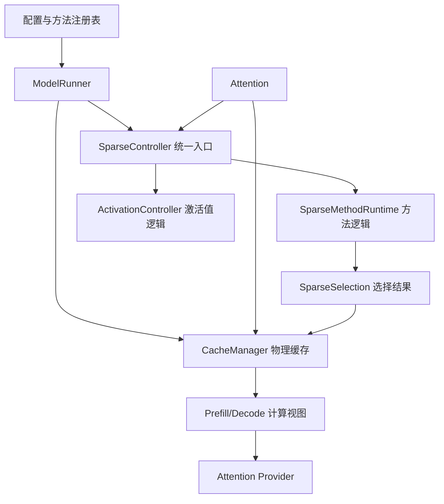

# 稀疏方法运行时架构

本文说明 Sparse-vLLM 如何组织不同的稀疏方法，以及新增方法时应该把代码放在
哪里。它也适用于接入模型原生的动态稀疏注意力（DSA）。

最重要的原则只有三条：

1. `CacheManager` 负责 KV Cache 的实际存储和长期状态。
2. `SparseMethodRuntime` 负责当前推理步骤中的打分、选择和跨层协调。
3. `SparseController` 只提供统一入口，不直接实现某一种稀疏算法。

这样做的目的，是让每种稀疏方法都能使用适合自己的存储方式，同时保持
Attention、Scheduler 和 ModelRunner 的通用路径简单、稳定。

## 整体关系



这里有两层统一接口：

- 推理引擎始终调用同一个 `SparseController`。
- `SparseController` 再把工作交给当前方法对应的
  `SparseMethodRuntime`。

`CacheManager` 是另一套独立接口，专门处理物理缓存。Runtime 和
CacheManager 可以各自复用代码，不要求使用相同的继承关系。

## 各组件负责什么

| 组件 | 主要职责 | 不应负责 |
| --- | --- | --- |
| `method_registry.py` | 方法名称、别名、默认调度方式、打分要求、模型兼容性、Prefix Cache 和 CUDA Graph 支持范围。 | 运行时张量、缓存分配。 |
| `SparseController` | 向推理引擎提供统一调用接口，把调用转交给 Runtime 和 ActivationController。 | 具体方法的判断分支和算法实现。 |
| `SparseMethodRuntime` | 当前步骤的逐层状态、注意力分数准备、稀疏位置选择、跨层结果传递，以及触发压缩或淘汰。 | 物理 slot 的所有权、与 Prefix Cache 绑定的长期元数据。 |
| `ActivationController` | 保存和使用隐藏层激活值，例如基于激活值的复用或跳层逻辑。 | KV Cache 分配和物理读视图。 |
| `CacheManager` | KV 或 latent cache、slot、page、压缩池、长期元数据、空间分配、压缩、重建、Prefix Cache 生命周期和计算视图。 | 调度策略和模型层中的方法判断。 |
| `MemoryOracle` / `RuntimeState` | 向 Scheduler 提供容量、临时空间需求和执行方式。 | 稀疏算法本身。 |
| `Attention` | 写入本层 KV、请求计算视图、运行 attention 算子并调用通用 hook。 | 识别稀疏方法名称或保存方法状态。 |
| Operator / Provider | 执行已经准备好的算子，并管理算子需要的工作区。 | 缓存分配和稀疏策略。 |

判断状态归属时，可以按下面的规则处理：

- 需要经历 append、Prefix Cache 命中、fork、恢复、回滚、offload 或释放的
  状态，放在 `CacheManager`。
- 每次 forward 都会重新准备，或者只负责把选择结果传到后续层的状态，放在
  `SparseMethodRuntime`。
- 从隐藏层激活值产生的状态，放在 `ActivationController`。
- 会影响请求是否能进入、能否组 batch 或需要多少显存的信息，通过
  `MemoryOracle` 或 `RuntimeState` 提供给 Scheduler。

## SparseController：统一入口

`src/sparsevllm/engine/sparse_controller.py` 应保持轻量。推理引擎主要使用以下
接口：

```python
class SparseController:
    def prepare_forward(self, seqs, is_prefill): ...
    def get_prefill_selection(self, layer_idx): ...
    def get_decode_selection(self, layer_idx, query): ...
    def on_layer_attention_end(self, layer_idx): ...
    def on_layer_end(self, layer_idx, context): ...
    def post_forward(self, seqs, is_prefill): ...
```

它还负责汇总 CUDA Graph 需要长期保留的张量、重置打分缓冲区、输出调试信息，
以及把 tokenizer 信息交给 `ActivationController`。

不要在这里增加 `if sparse_method == ...`。如果一个方法需要特殊行为，应在
对应 Runtime、CacheManager 或其他职责明确的通用接口中实现。

## SparseMethodRuntime：方法逻辑

`src/sparsevllm/engine/sparse_methods/base.py` 定义了统一的输入类型：

- `SparseStepContext`：一次 prefill 或 decode 的上下文。
- `PrefillSelectionRequest`：某层的 prefill 选择请求。
- `DecodeSelectionRequest`：某层的 decode 选择请求，其中包含当前 query。
- `AttentionEndEvent`：某层 attention 完成后的通知。
- `LayerEndEvent`：整个模型层完成后的通知。

Runtime 在不同阶段执行以下工作：

| 方法 | 调用时机 | 作用 |
| --- | --- | --- |
| `prepare_step` | 进入模型层之前 | 读取当前 batch 的缓存信息，准备逐层状态和打分缓冲区。 |
| `needs_attention_score` | 准备阶段 | 判断当前层是否需要收集注意力分数。 |
| `build_prefill_selection` | Prefill attention 之前 | 生成本层的逻辑选择结果。 |
| `build_decode_selection` | Decode attention 之前 | 根据当前状态和 query 生成逻辑选择结果。 |
| `on_attention_end` | Attention 完成后 | 完成必须等待 attention 结束才能做的打分处理。 |
| `on_layer_end` | 模型层结束后 | 处理分数并把选择结果传给后续层。 |
| `finish_step` | 整次 forward 结束后 | 触发压缩、淘汰或其他收尾操作。 |

`LayerBatchSparseState` 只表示当前推理步骤中的逐层逻辑状态。它可以引用
CacheManager 中的稳定张量，但不负责这些张量的分配和释放。

## Runtime 如何复用代码

`engine/sparse_methods/factory.py` 在初始化时，根据规范化后的方法名选择 Runtime。
逐层执行时不再查询注册表，也不再按方法名分支。

当前 Runtime 按实际处理方式进行少量继承：

| Runtime | 当前方法 | 共同点 |
| --- | --- | --- |
| `PassThroughRuntime` | vanilla、QuEST | Controller 侧返回完整逻辑选择，特殊物理视图由 CacheManager 或 Provider 构造。 |
| `StreamingLLMRuntime` | StreamingLLM | Attention 使用普通视图，结束后按 sink 和 recent window 物理淘汰。 |
| `ScoredCompactionRuntime` | SnapKV、PyramidKV | 共用打分和物理压缩流程；PyramidKV 使用逐层预算。 |
| `H2ORuntime` | H2O | 准备 H2O 的 prefill 分数，并触发 CacheManager 中的累计重要度更新和淘汰。 |
| `JointDecodeRuntime` | R-KV、SkipKV | 共用 decode 压缩流程，但分数来源和选择算法不同。 |
| `DynamicSelectionRuntime` | OmniKV、DeltaKV | 在观察层收集分数，并把动态选择结果传给后续层。 |

只有以下行为确实一致时，才应继承同一个 Runtime：

- 分数的含义和形状；
- 触发压缩或选择的时机；
- 选择的是 token、slot、page 还是压缩索引；
- 修改 CacheManager 的顺序；
- Prefix Cache 行为；
- CUDA Graph 缓冲区的使用方式。

如果这些行为不一致，应新增独立 Runtime，只抽取真正共用的小函数。

CacheManager 的继承体系处理的是另一类问题，例如物理布局、slot 分配、Prefix
Cache 和显存核算。因此，两个方法即使共用 Runtime，也不一定应该共用同一个
CacheManager 基类；反过来也一样。

## 从选择结果到 Attention 计算

一次 attention 调用按照下面的顺序进行：

1. Runtime 生成 `SparseSelection`，说明逻辑上要看哪些内容。
2. Attention 把选择结果以及当前 query、K、V 交给 `CacheManager`。
3. `CacheManager` 将逻辑位置转换成物理 slot、page、latent cache 或临时重建结果。
4. `CacheManager` 返回 `PrefillComputeView` 或 `DecodeComputeView`。
5. Attention Provider 使用这个计算视图运行算子，不需要知道稀疏方法名称。

常用的数据类型包括：

- `SparseSelection`：逻辑选择结果；
- `AttentionViewMeta`、`PagedDecodeViewMeta`：物理位置和长度信息；
- `PrefillComputeView`、`DecodeComputeView`：算子使用的完整计算视图；
- `ExplicitKVPayload`、`MlaLatentPayload`：实际缓存数据。

不要通过 `layers/attention.py` 传递方法专用 tuple、整个配置对象、隐藏的全局张量
或方法名称。

QuEST 是一个典型例子。它的 Runtime 返回普通的完整逻辑选择，但
`QuestCacheManager` 和选择算子会使用当前 query 构造原生物理页视图。QuEST 的
page metadata 长期跟随物理缓存，因此应留在 CacheManager，而不是复制到
Runtime。

## Prefix Cache 和 CUDA Graph

Prefix Cache 保存的是物理缓存状态，所以由 `CacheManager` 负责。与某段 KV
对应的长期元数据，必须和 KV 一起支持：

- 分配和追加；
- Prefix Cache 命中和挂接；
- fork；
- 恢复和回滚；
- 淘汰和 offload；
- 释放。

Prefix Cache 挂接完成后，Runtime 从 CacheManager 提供的当前 batch 状态重新
构建逻辑状态。Runtime 不应长期保存可能在缓存转移后失效的物理位置。

Runtime 可以持有 CUDA Graph 使用的打分或选择工作区，但必须满足：

- 在 capture 前完成分配；
- 通过 `decode_graph_keepalive_tensors` 保证张量不会被释放；
- replay 前正确重置输入分数；
- replay 期间不临时分配，不查询方法注册表，也不切换到其他实现；
- eager 和 CUDA Graph 得到相同的选择和输出。

## 接入新方法或 DSA 模型

建议按以下顺序接入：

1. 在配置和 `method_registry.py` 中登记方法名、支持范围和默认行为。
2. 明确支持哪些模型、缓存布局、并行方式和 Attention Provider，并拒绝不支持的
   组合。
3. 在 CacheManager 或存储模块中实现长期物理状态及其完整生命周期。
4. 选择已有 Runtime，或者新增 Runtime，并在 Runtime factory 中登记。
5. 使用统一的选择类型和计算视图连接 Runtime、CacheManager 与 Attention。
6. 通过 `MemoryOracle` 或 `RuntimeState` 告诉 Scheduler 实际容量和临时空间需求。
7. 只有确实需要时，才增加 ActivationController 或新算子。
8. 对声明支持的 Prefix Cache 和 CUDA Graph 路径逐项验证。

接入模型原生 DSA 时，先判断模型实际提供了什么：

- 已选 token 的索引；
- 根据 query 选择 page 的规则；
- 压缩或 latent cache；
- 需要长期保存的路由信息。

随后仍按相同方式分工：

- 模型和 layout 代码说明存储及算子需要的数据格式；
- Runtime 负责打分、选择和跨层传递；
- CacheManager 负责物理缓存和长期元数据；
- Provider 使用统一计算视图或模型原生数据运行算子；
- Scheduler 只读取容量和执行限制。

不要在 Attention、ModelRunner 或 Scheduler 中直接增加某个 DSA 方法的判断。
如果现有类型无法表达新的缓存数据，应扩展最小的统一数据类型，而不是绕开现有
接口。

## 提交前需要确认

- `SparseController`、Attention、ModelRunner 和 Scheduler 没有新增方法名分支。
- 物理缓存元数据和 slot 生命周期仍由 CacheManager 负责。
- Runtime factory 中的方法映射清楚、可检查。
- 分数形状、类型、初始值、归一化顺序、Top-K 相同分数处理、触发边界和修改
  顺序符合算法原定义。
- 声明支持 Prefix Cache 时，已经覆盖首次运行、命中、追加、fork、恢复和释放。
- 声明支持 CUDA Graph 时，已经验证张量地址稳定，并与 eager 结果一致。
- 先用固定输入比较生成 token，再进行质量评测。
- 性能比较使用相同请求、Provider、预算和有效实验产物。

完整的接入和验证步骤见仓库内的 `$add-sparse-method` skill。
